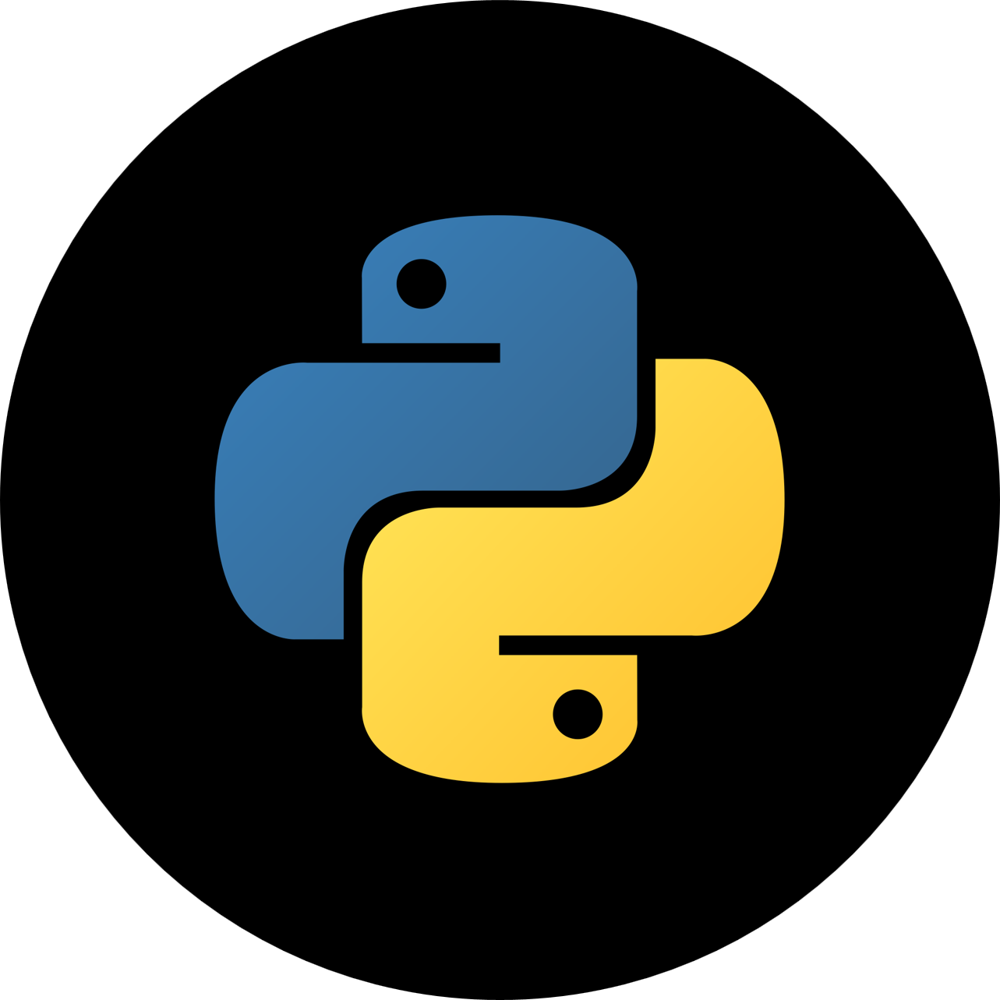
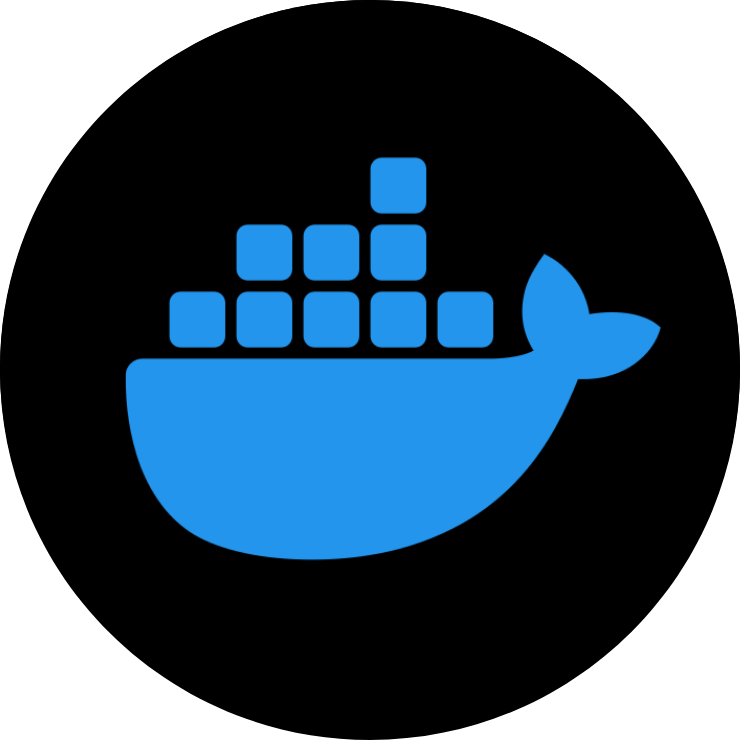
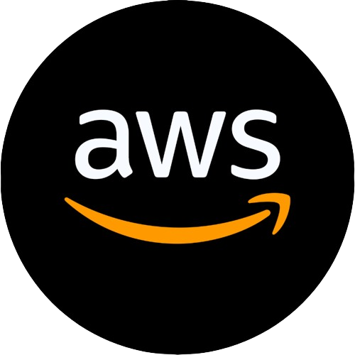
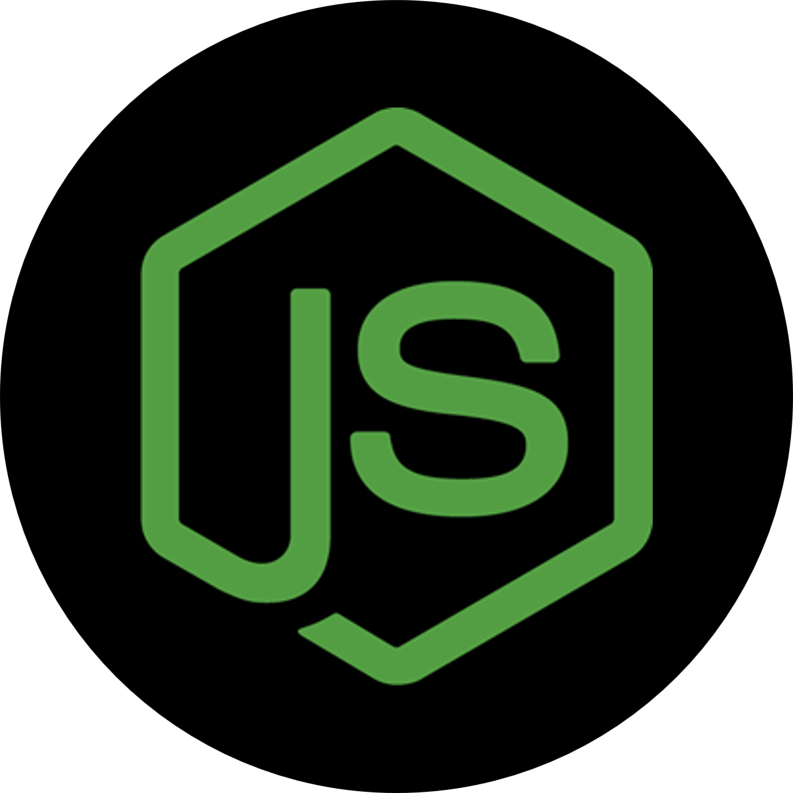
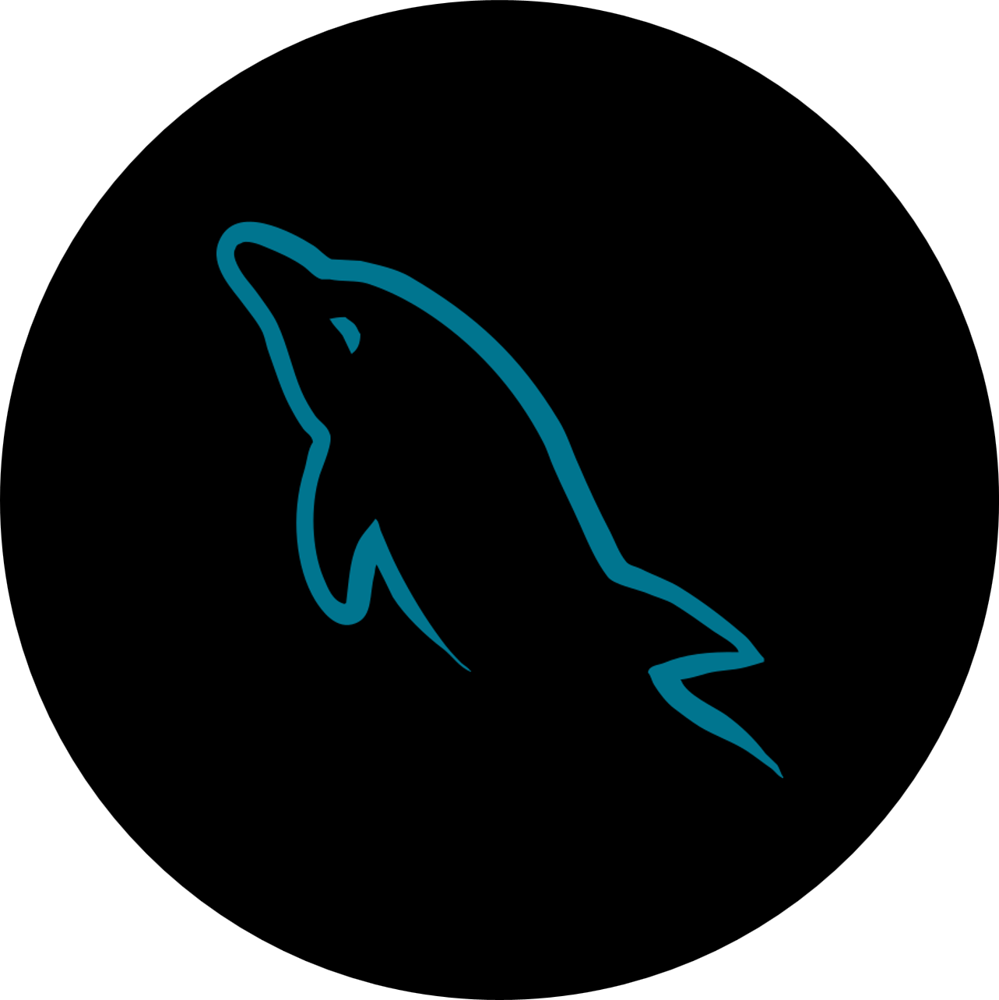
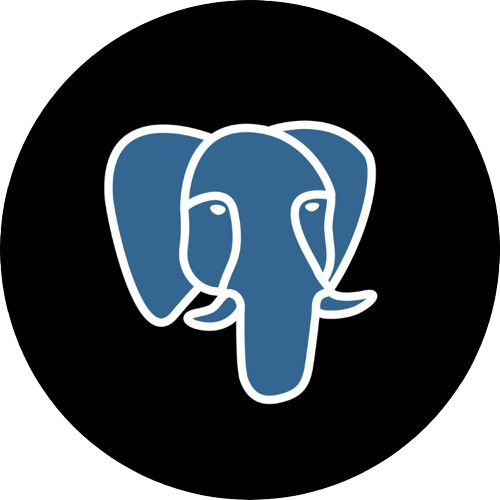
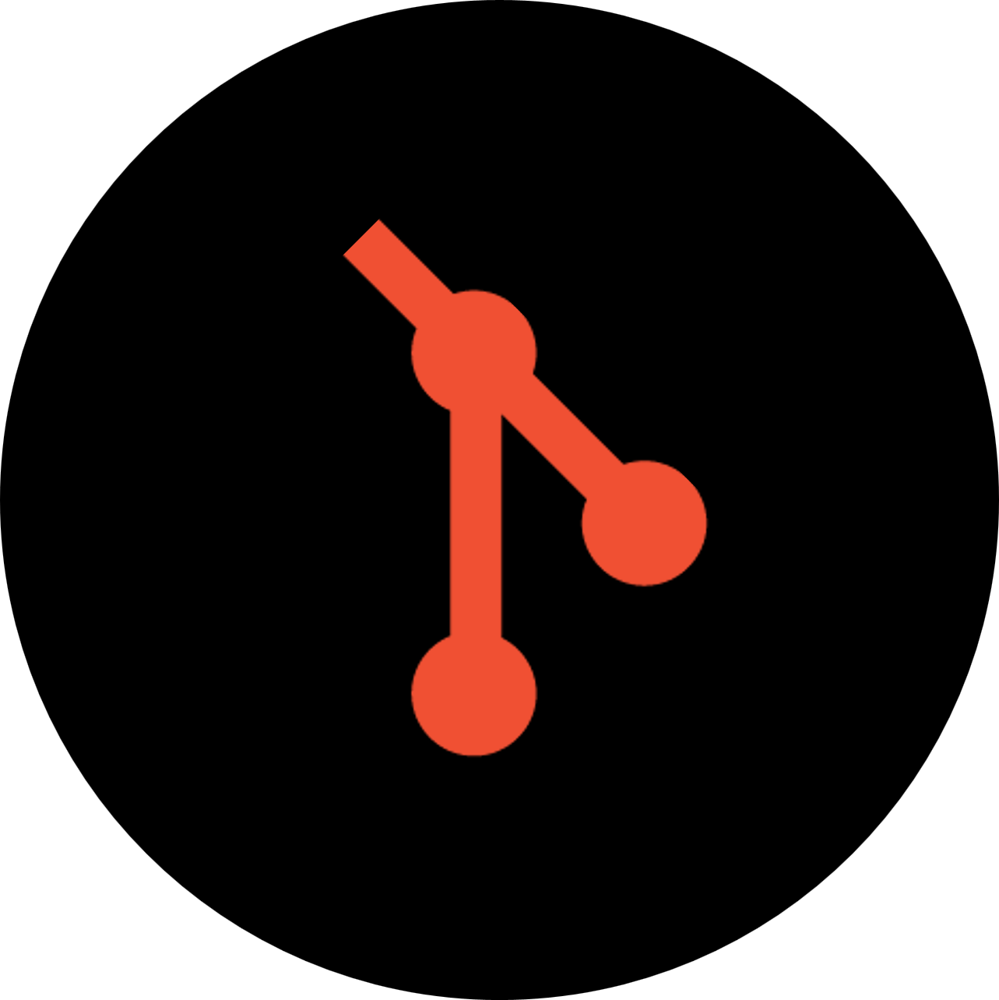
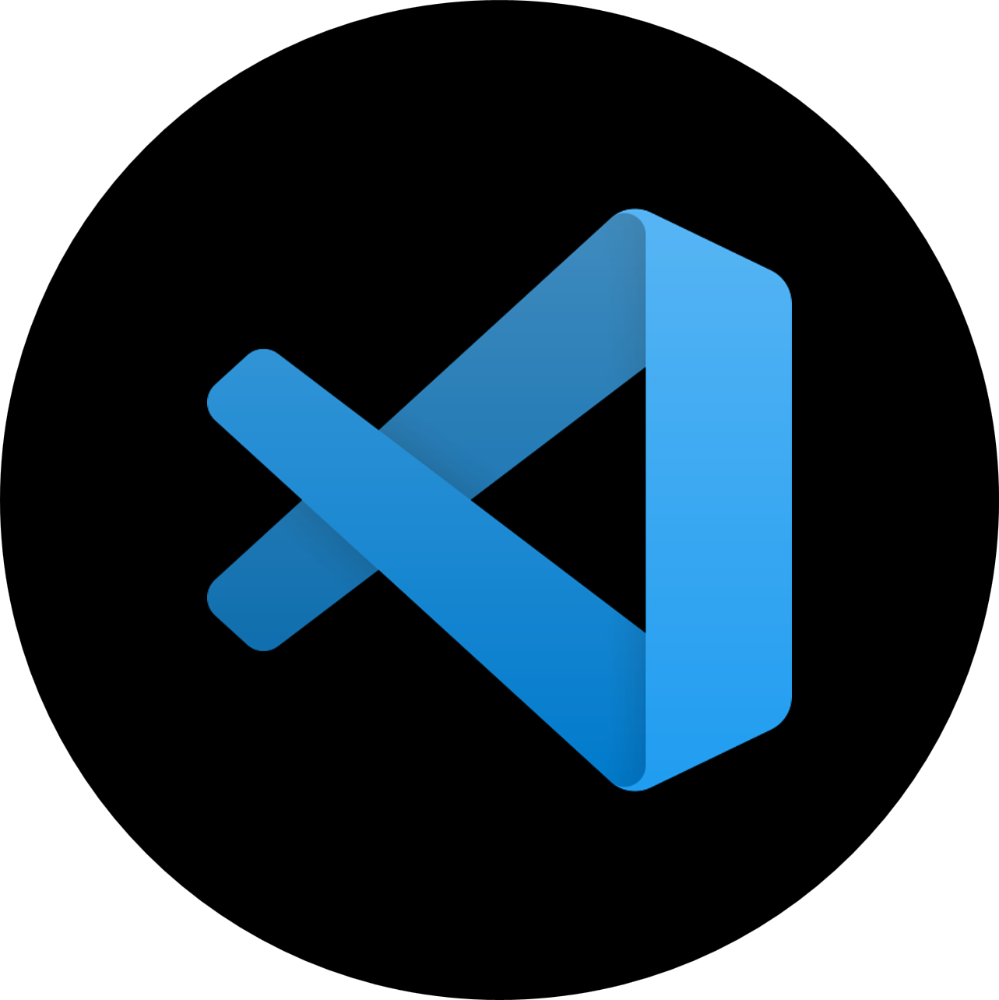
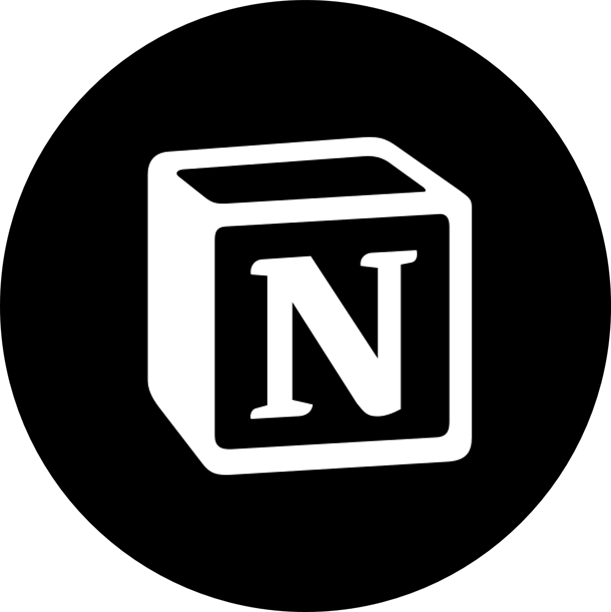

# Hi there, I'm Mario Aparcero 👋

### Systems Administrator | Linux Enthusiast | Expert in Servers, Networking, and Automation | 5+ Years in Managing Scalable IT Infrastructures

I'm a seasoned SysAdmin with a passion for open-source technologies, cybersecurity, cloud infrastructure, and automation. I specialize in deploying and maintaining reliable and secure systems across various platforms. From on-premise servers to hybrid cloud setups, I ensure everything runs smoothly and efficiently.

## ⚙️ My Stack

<table>
  <tr>
    <td align="center"><strong>OS & Distros 🖥️</strong></td>
    <td align="center"><strong>Automatización 🤖</strong></td>
    <td align="center"><strong>Contenedores & Virtualización 📦</strong></td>
  </tr>
  <tr>
    <td valign="top">
      
      
      
      
      
    </td>
    <td valign="top">
      
      
      
      
    </td>
    <td valign="top">
      
      
      
    </td>
  </tr>
</table>

<table>
  <tr>
    <td align="center"><strong>Cloud ☁️</strong></td>
    <td align="center"><strong>Redes & Seguridad 🔐</strong></td>
    <td align="center"><strong>Web & Desarrollo 💻</strong></td>
  </tr>
  <tr>
    <td valign="top">
      
      
      
      
      
    </td>
    <td valign="top">
      
      
      
      
      
    </td>
    <td valign="top">
      
      
      
      
    </td>
  </tr>
</table>

<table>
  <tr>
    <td align="center"><strong>Bases de datos 🗄️</strong></td>
    <td align="center"><strong>DevOps & Version Control 🔄</strong></td>
    <td align="center"><strong>Colaboración & Gestión 📋</strong></td>
  </tr>
  <tr>
    <td valign="top">
      
      
      
    </td>
    <td valign="top">
      
      
      
      
    </td>
    <td valign="top">
      
      
      
      
      
    </td>
  </tr>
</table>

## More Skills:

- Network troubleshooting and configuration (TCP/IP, DNS, DHCP)
- Virtualization (KVM, VirtualBox, VMware)
- Containerization with Docker
- Cloud resource management (IAM, storage, compute)
- Automation of routine tasks
- Shell scripting for daily sysadmin tasks

<table>
  <tr>
    <td colspan="2" align="center"><strong>Stats 📊</strong></td>
  </tr>
  <tr>
    <td valign="top">
      
    </td>
    <td valign="top">
      
    </td>
  </tr>
</table>

## 📫 Contacto

¿Quieres colaborar o tienes alguna consulta técnica?

- 📧 Email: marioaparcero@hotmail.com  
- 🌐 LinkedIn: [linkedin.com/in/marioaparcero](https://linkedin.com/in/marioaparcero)  
<!-- - 💻 Portfolio: [marioaparcero.dev](https://marioaparcero.dev) -->

---

_Disfruto automatizando problemas reales, aprendiendo cada día algo nuevo y construyendo infraestructuras resilientes y seguras._

---

> 🔍 *“La automatización no es el futuro. Es el presente bien hecho.”*
